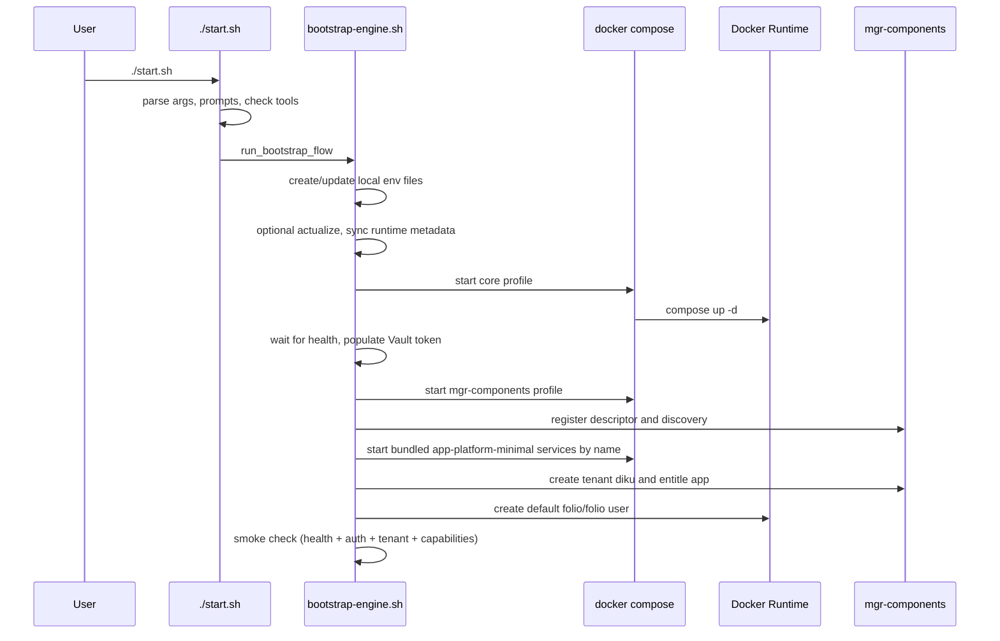

# Key Flows

The most important operational flows performed by `eureka-platform-bootstrap`
today. Descriptive on purpose, so future refactoring can preserve core behavior.

## 1. Bootstrap flow (primary)

### Trigger

- operator runs `./start.sh` (optionally with runtime flags such as
  `--actualize`, `--native-sidecar`, `--yes`, or `--debug`)

### Primary files involved

- `start.sh` (thin entrypoint)
- `misc/bootstrap-engine.sh` (orchestration) + `misc/lib/{folio-common,folio-api,docker-health}.sh`
- `docker/.env.local`, `docker/.env.local.credentials`
- `docker/compose.yaml`
- bundled `descriptors/app-platform-minimal/descriptor.json` + sibling
  `discovery.json`

### Flow

### Descriptor boundary

- `./start.sh` consumes the bundled `app-platform-minimal` descriptor.
- `--actualize` (optionally `--pre-release`) refreshes module versions in the
  descriptor before bootstrap continues.
- Runtime sync regenerates the sibling `discovery.json`, removes superseded
  generated module env state from `.env.local`, and exports descriptor-derived
  `MOD_*_IMAGE` / `MOD_*_VERSION` values in-memory for Compose.

## 2. Native Docker access

Operators may use `docker compose` directly from `docker/` when managing their
own environment values. It is not a supported alternative to the bootstrap flow.

## 3. Module version synchronization flow

Keeps application metadata and runtime values aligned.

- `misc/module-version-actualizer.py --app descriptors/app-platform-minimal/descriptor.json` — refresh
  app-platform-minimal descriptor versions from the FOLIO registry.
- `misc/docker-module-updater/run.py --app descriptors/app-platform-minimal/descriptor.json` — derive module versions,
  regenerate app-platform-minimal `discovery.json`, and clean old generated module env state.
  (`--services` resolves the Compose service list; `--module-env` prints
  descriptor-derived shell exports.)

## 4. User creation flow

The internal user-provisioning worker invoked by bootstrap creates `folio/folio`:

1. read local credential state
2. fetch the M2M client secret from Vault
3. obtain a service token from Keycloak
4. create or locate the target user and set password
5. find or create the `Admin` role
6. attach capabilities and role assignments

## 5. Shutdown and reset flow

- `./stop.sh` (repo root) drives teardown via two prompts:
  - Soft teardown: remove containers (default yes) — removes the stack, keeps volumes.
  - Hard reset: clear volumes (default no) — also removes the PostgreSQL, Kafka, and
    Vault volumes. Clearing volumes implies removing containers.
- `./stop.sh --yes` accepts defaults non-interactively (remove containers, keep volumes).

## Flow summary

Across all flows the repository repeatedly: resolves local config, turns repo
definitions into running runtime units, and applies post-start bootstrap actions.
These recurring patterns are the anchors for further simplification.
