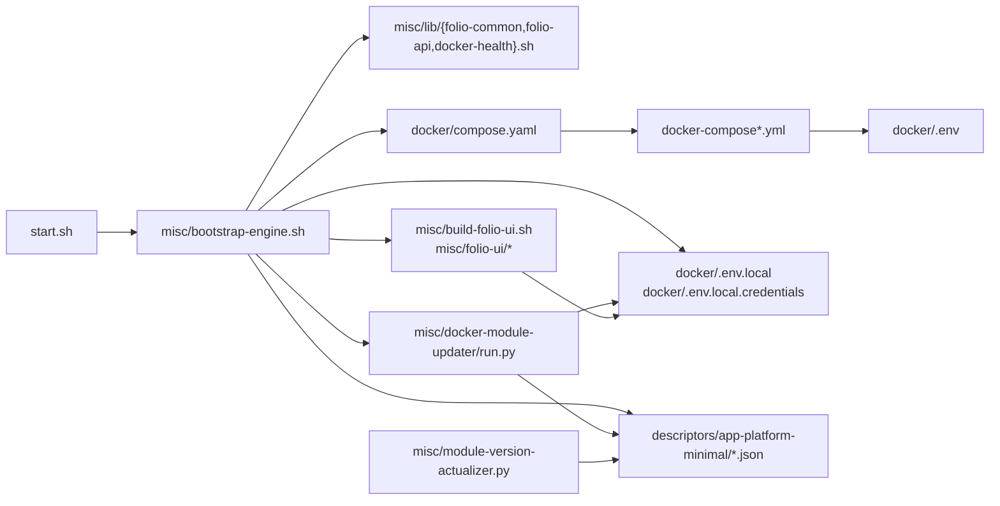

# Repository Components

A practical C4 component-style view of the repository: how it is organized, which
areas own which responsibilities, and how the main pieces interact.

## Repository structure

| Area | Purpose | Main artifacts |
| --- | --- | --- |
| repository root | the single entrypoint and primary docs | `start.sh`, `README.md`, `AGENTS.md` |
| `docker/` | Compose runtime model and environment definitions | `docker-compose*.yml`, `.env`, `.env.local`, `.env.local.credentials` |
| `descriptors/` | application metadata for registration and discovery | `descriptors/app-platform-minimal/{descriptor,discovery}.json` |
| `misc/` | bootstrap orchestration, libraries, and helper tooling | `bootstrap-engine.sh`, `lib/*`, version/UI/user helpers |
| `docs/` | architecture docs and roadmap | current documentation set |

## Component relationships

## Major components

### 1. Entrypoint and orchestration

`start.sh` is the single operator entrypoint, intentionally thin: argument parsing,
a couple of prompts, tool checks, then it sources the libraries and runs the flow.

`misc/bootstrap-engine.sh` owns the bootstrap phase sequence (`run_bootstrap_flow`)
and the local-setup helpers (env files, `/etc/hosts`, descriptor service
resolution, optional ARM/UI builds). It sources the libraries below.

The reusable logic lives in three libraries:

- `misc/lib/folio-common.sh` — logging, config loading, output helpers, deps
- `misc/lib/folio-api.sh` — tokens, descriptor/discovery registration, entitlement,
  capabilities wait, smoke check
- `misc/lib/docker-health.sh` — container health and HTTP route readiness waits

### 2. Docker orchestration

- `docker/compose.yaml` explicitly includes the Compose layer files.
- `start.sh` and `stop.sh` invoke native `docker compose` after resolving the
  effective bootstrap configuration.
- `stop.sh` (repo root) tears down the environment: prompts to remove containers
  (default yes) and to clear the persistent volumes (default no).

### 3. Configuration layers

- `docker/.env` — committed defaults and support image defaults
- `docker/.env.local` — human local runtime overrides
- `docker/.env.local.credentials` — local credentials and secret-store token state

Service-level environment variables are defined inline in the Compose files (YAML
anchors for shared values). The local override files are sourced as shell files.

### 4. Application descriptor layer

`descriptors/app-platform-minimal/` holds `descriptor.json` (application metadata +
module list) and `discovery.json` (module discovery endpoints), used during
bootstrap when the environment is registered through the manager components.

### 5. Version synchronization utilities

- `misc/module-version-actualizer.py` updates `descriptor.json` from FOLIO registry data.
- `misc/docker-module-updater/run.py` rebuilds `discovery.json`, cleans superseded
  generated module env state, prints descriptor-derived `--module-env` exports,
  and resolves the `--services` list.

### 6. Optional UI build subsystem

- `misc/build-folio-ui.sh` orchestrates repository retrieval, config preparation, and image build
- `misc/folio-ui/*` contains helper scripts for the build process
- `docker/docker-compose.ui.yml` defines the optional runtime service

## Operational entry points

| Entrypoint | Role today |
| --- | --- |
| `start.sh` | single operator entrypoint |
| `stop.sh` | environment teardown (containers + optional volumes) |

The UI, user, image, and descriptor workers are internal implementation files
called by `start.sh`, not operator entrypoints.

## Why this view matters

The repository keeps a clear split between runtime definition, runtime bootstrap,
application metadata, and optional experience layers. That split — now expressed as
a thin entrypoint over focused libraries — is the structure to preserve and refine.
