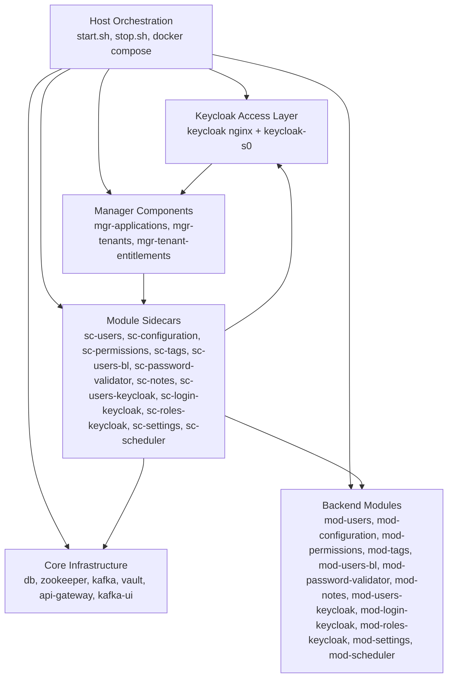

# Runtime Containers

This document provides a practical C4 container view for the runtime assembled by `eureka-platform-bootstrap`.

The word "container" is used in the C4 sense of deployable runtime units. For readability, closely related Docker containers are grouped into functional runtime containers when they operate as one layer.

## Runtime Container View

## Runtime Layers

| Runtime container | Main contents | Purpose | Key configuration inputs |
| --- | --- | --- | --- |
| Host orchestration | `start.sh`, `stop.sh`, `misc/bootstrap-engine.sh`, `docker/compose.yaml` | Coordinates Docker lifecycle and post-start bootstrap steps | shell environment, `docker/.env*`, user answers |
| Core infrastructure | PostgreSQL, Zookeeper, Kafka, Vault, Kong, Kafka UI | Shared services required by the rest of the platform | `docker/docker-compose.core.yml`, `docker/.env*` |
| Keycloak access layer | `keycloak` nginx front door and `keycloak-s0` backend node | Authentication and authorization entrypoint for the platform | `docker/docker-compose.keycloak.yml`, `docker/.env*` |
| Manager components | `mgr-applications`, `mgr-tenants`, `mgr-tenant-entitlements` | Platform management APIs for app registration, tenant lifecycle, and entitlements | `docker/docker-compose.mgmt.yml`, `docker/.env*` |
| Backend modules | `mod-*` services for the minimal application | Business and platform functionality used by FOLIO | `docker/docker-compose.minimal.module.yml`, `docker/.env*` |
| Sidecar layer | `sc-*` services, one per backend module | Auth, tenancy, discovery, and request forwarding boundary in front of modules | `docker/docker-compose.minimal.sidecar.yml`, `docker/.env*` |

## Layer Responsibilities

### Core infrastructure

The core layer provides the substrate that everything else depends on:

- PostgreSQL stores service databases and tenant-specific schemas.
- Vault holds secret material used by manager components and module integrations.
- Kong acts as the main API gateway.
- Kafka and Zookeeper provide messaging infrastructure.
- Kafka UI provides optional inspection of Kafka state.

### Keycloak access layer

Keycloak is modeled as an nginx front door named `keycloak` and at least one backend Keycloak node named `keycloak-s0`.

This gives the repository a cluster-ready shape while still running locally with a single active node by default.

### Manager components

The manager layer exposes platform-management APIs:

- `mgr-applications` manages application registration and validation.
- `mgr-tenants` manages tenant lifecycle.
- `mgr-tenant-entitlements` manages application-to-tenant installation and entitlement flow.

These services are a key bridge between static repository definitions and actual runtime enablement.

### Backend modules and sidecars

The minimal FOLIO application is implemented as backend `mod-*` services, each fronted by a `sc-*` sidecar.

The sidecar layer is the public integration boundary for these modules. It handles:

- Keycloak-aware access behavior
- multi-tenant request handling
- discovery-based routing support
- request forwarding to the corresponding backend module

## Current Runtime Sequencing

The current runtime is expected to appear in a layered order:

1. core infrastructure
2. Keycloak access layer
3. manager components
4. descriptors and discovery registration
5. backend modules and sidecars
6. tenant bootstrap and user creation

That layered sequencing is central to understanding both the current design and the future simplification work.
