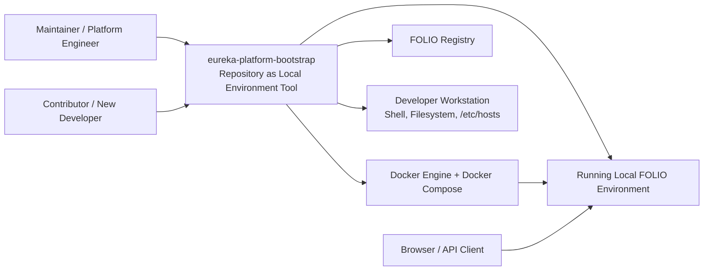

# System Context

This document provides a practical C4 level 1 view of `eureka-platform-bootstrap`.

## Software System Under Discussion

The software system under discussion is the repository itself, treated as a local-environment orchestration tool.

It is not only a collection of files. In practice, it behaves like an operator-facing system that:

- defines the local runtime topology
- supplies default and local configuration
- orchestrates startup and shutdown
- bootstraps the environment after container startup

## Context Diagram

## People And Primary Use Cases

| Actor | Uses the repository for | Typical entrypoints |
| --- | --- | --- |
| Maintainer / platform engineer | start, repair, upgrade, and evolve the local environment | `./start.sh`, `./stop.sh` |
| Contributor / new developer | bring up the environment and understand how it is organized | `README.md`, `./start.sh`, `./stop.sh` |

## External Systems And Dependencies

| External system | Relationship to repository | Examples |
| --- | --- | --- |
| Docker Engine and Docker Compose | Main runtime execution engine | invoked directly by the bootstrap through `docker/compose.yaml` |
| Developer workstation | Provides shell, filesystem, `/etc/hosts`, local Docker access | modified during bootstrap by `./start.sh` |
| FOLIO Registry | Source for module version metadata | used by `misc/module-version-actualizer.py` |
| Browser / API client | Consumes the running local platform | Kong API access, Keycloak access, Kafka UI inspection |

## Boundary Of Responsibility

Inside the repository boundary:

- Compose service definitions
- local config defaults and overrides
- application descriptors and discovery files
- startup/bootstrap scripts
- helper operations for users and tenants

Outside the repository boundary:

- upstream service implementation code
- long-term production deployment concerns
- upstream module release pipelines
- generic cloud or multi-environment environment management

## Why This View Matters

This context view keeps the architectural focus in the right place.

The repository is not only a data directory for Docker Compose. It is the system that translates operator intent into a local FOLIO environment. That is why the future transformation work must preserve both:

- the runtime foundation it defines, and
- the human-facing experience of configuring, launching, and understanding that runtime.
